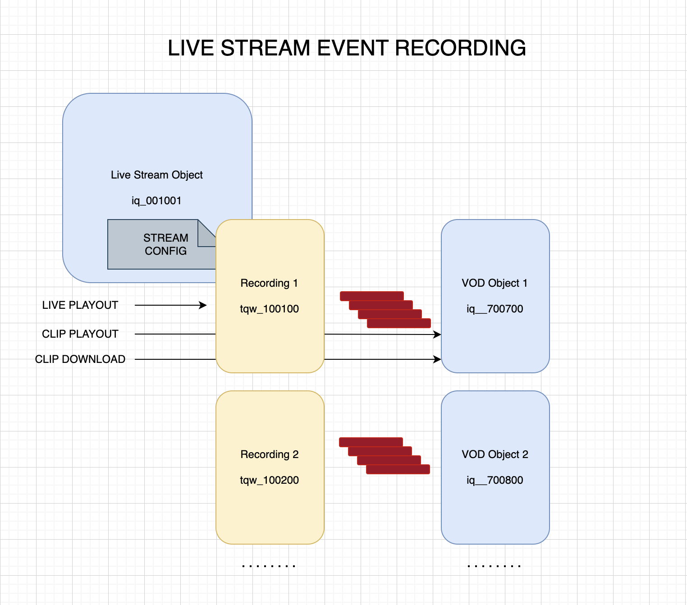

## OVERVIEW

### LIVE STREAM LIFE CYCLE

A live stream is a content object of type "live stream".

The main operations on the live stream are:

- Create
- Configure
- Start a recording
- May stop and start - this will create multiple recording periods in the recording
- End the recording
- Copy to VOD
- Deactivate (discard) the recording

### LIVE STREAM STATES

- unconfigured
- inactive
- starting
- running
- stalled
- stopped


## RUN THE LIVE STREAM MANAGEMENT PROXY

One time setup:

```
    npm install
```

First:

```
    export PRIVATE_KEY=0x...
```

Then:

```
    node StreamApiServer.js
```

## API

### Stream status

`GET /streams/:stream_id`

Example:
```
curl http://localhost:9001/streams/iq__2pLcFBmqEgHj2a2wdWyvLV6tcj44
```

### Start a new recording

`POST /streams/:stream_id/start_recording`

Body:
```
{
    "vod": true | false,
    "vod_name": "string",  // Required if vod 'true'
    "vod_id": "string"     // Required if vod 'true'

}
```

If a VOD object is created, it is stored with the live stream recording so subsequent calls to create VOD will update the same object (effectively creating a progressive VOD).  The process is incremental.

Example:
```
curl http://localhost:9001/streams/iq__2pLcFBmqEgHj2a2wdWyvLV6tcj44/start_recording -d '{"vod": true, "vod_name": "Team A v Team B", "vod_id":"F3DD3C39-565C-40AF-AB7F-3D216D57F5CC"}'
```

### Stop (end) a recording

`POST /streams/:stream_id/stop_recording`

Body:
```
{
    "vod": true | false,
    "vod_name": "string",    // Required if vod not previously created
    "vod_id": "string"       // Required if vod not previously created
    "discard": true | false  // Discard after creating VOD object
}
```

Example:
```
curl http://localhost:9001/streams/iq__2pLcFBmqEgHj2a2wdWyvLV6tcj44/stop_recording -d '{"discard": true, "vod":true}'

```

### Make VOD

A VOD object can be updated progressively by simply calling the same API.  The VOD obeject ID is saved with the live stream recording.

`POST /streams/:stream_id/vod`

Body:
```
{
    "vod_name": "string",    // Required if vod not previously created
    "vod_id": "string"       // Required if vod not previously created
}
```

### Make clip (live stream)

`POST /streams/:stream_id/clip`

Where: `stream_id` can be either the object ID (`iq__`) or hash (`hq__`)

Body:
```
{
    "clip_start": 0,  // Seconds since start
    "clip_end": 0     // Seconds since start (0 means play to the end)
}
```

Example:

```
curl http://localhost:9001/streams/iq__BUTeBCqV9Rt1RCUhnY8NG8dFDs5/clip -d '{"clip_start":240, "clip_end":360}'
```

### Make clip (VOD object)

`POST /vod/:vod_id/clip`

Body:
```
{
    "clip_start": 0,  // Seconds since start
    "clip_end": 0     // Seconds since start (0 means play to the end)
}
```

Example:

```
curl http://localhost:9001/vod/iq__2aN6A5AQZxjo4Q82NK2c3DV6hrbM/clip -d '{"clip_start": 520, "clip_end": 550}'
```


## COMMON FLOWS

### LIVE EVENTS RECORDING TO VOD


